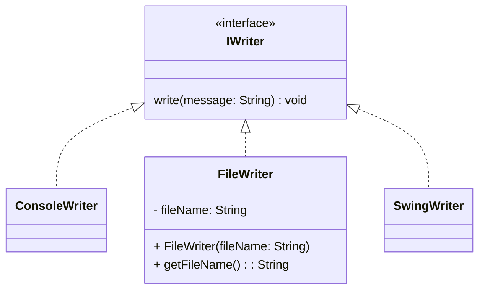

# interface #
Les interfaces servent à déclarer des méthodes 
dans le but d'implémenter ces méthodes dans des classes.
Ces classes implémentent l'interface.

Cela permet d'écrire du code élégant, facilement testable et réutilisable.

## demo interface ##
Nous avons le diagramme de classes suivant
