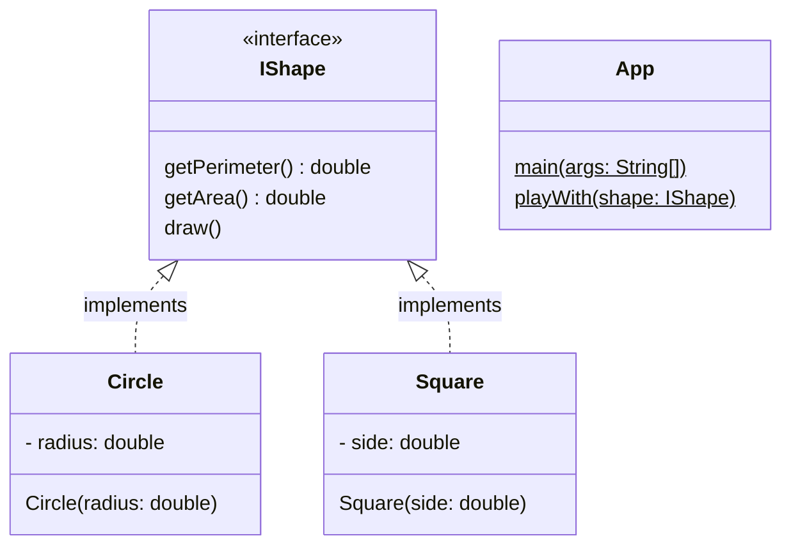

# Exercice Shape
Ecrivons le code correspondant au diagramme de classes ci-dessous:

La méthode main de la classe App est une boucle sur un menu:
- tapez C pour un cercle
- tapez S pour un carré
- tapez Q pour quitter

Si l'utilisateur tape Q, l'application affiche "à bientôt" et s'arrête.

Si l'utilisateur tape C ou S, l'application demande le rayon ou le côté.

Ensuite, l'application affiche le périmètre et l'aire de la forme. Ensuite, elle "dessine" la forme, ou plus exactement, elle affiche un message "le cercle de 5 cm est dessiné" (car notre application est une application console).

Finalement, elle réaffiche le menu.
